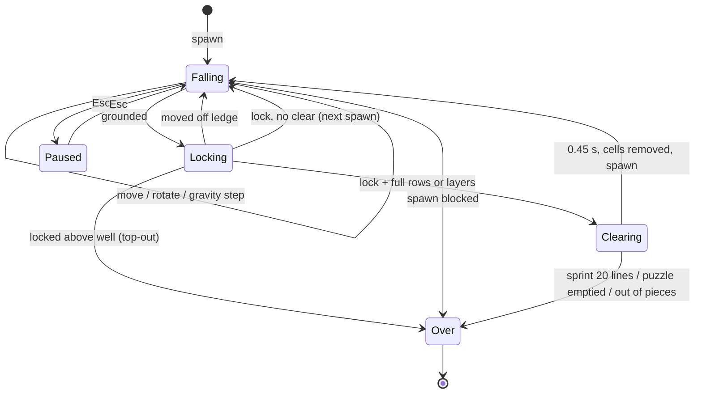
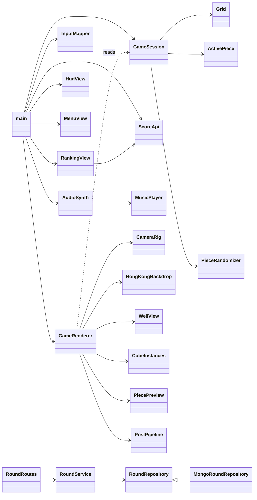
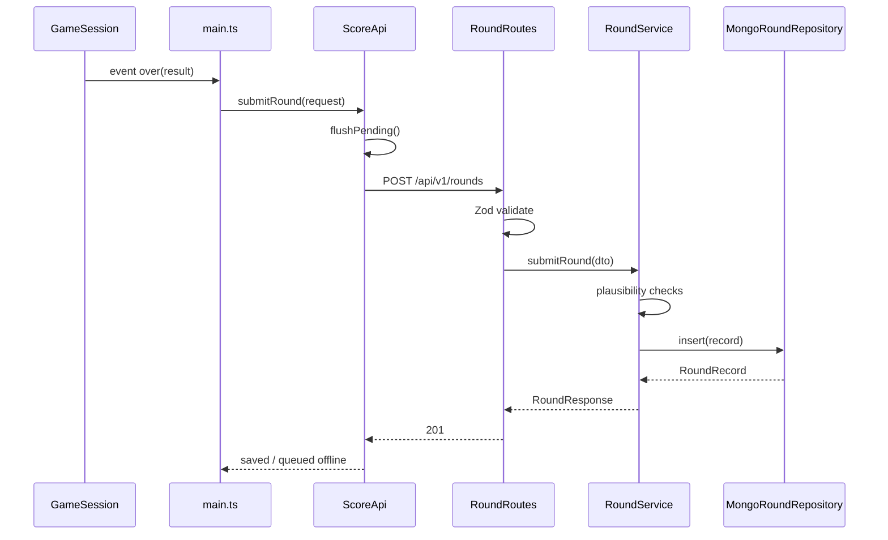
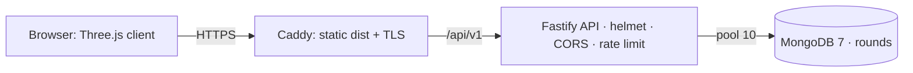

# Tetracube Well · Hong Kong

A 3D Tetris (tetracube) browser game built with Three.js and TypeScript, with a Fastify + MongoDB ranking API and a Docker / HTTPS deployment.

- 10×10×10 see-through well, 8 tetracubes (I, O, L, T, S, Branch, Right Screw, Left Screw)
- Full X/Y rows and full layers clear; same-colour rows multiply the score ×2 / ×4 / ×8
- Physically based cube materials (glass, jelly, brushed metal, iridescent), bloom, particles
- Selectable backdrops: your own photos or a procedural Hong Kong skyline shader
- Classic Korobeiniki music synthesised live with WebAudio
- Online ranking (marathon by score, sprint by time) with offline queueing

The original game design (Traditional Chinese) is in [`3d_tetris_game_design_document_traditional_chinese.md`](3d_tetris_game_design_document_traditional_chinese.md).

## Contents

1. [Quick start](#1-quick-start)
2. [How to play](#2-how-to-play)
3. [Game rules](#3-game-rules)
4. [Architecture](#4-architecture)
5. [REST API and data model](#5-rest-api-and-data-model)
6. [Deployment](#6-deployment)
7. [Testing](#7-testing)
8. [Physics and shader formulas](#8-physics-and-shader-formulas)
9. [Design decisions and known limitations](#9-design-decisions-and-known-limitations)

## 1. Quick start

Requirements: Node.js ≥ 20, npm, Docker (for MongoDB), a browser with WebGL2.

```bash
npm install
cp .env.example .env            # optional, defaults match
scripts/dev.sh                  # Mongo + API (watch) + Vite over HTTPS on :5173
```

Or run the pieces yourself:

```bash
docker compose up -d mongo
npm run dev:server              # API on http://localhost:3000
npm run dev                     # game on http://localhost:5173 (/api proxied to :3000)
npm run dev:https               # same, over HTTPS with a self-signed cert
```

The game is fully playable without the API; rounds are queued in `localStorage` and uploaded later.

| Script                      | Purpose                                                              |
| --------------------------- | -------------------------------------------------------------------- |
| `npm run dev` / `dev:https` | Vite dev server (HTTP / HTTPS)                                       |
| `npm run dev:server`        | API with `tsx watch`                                                 |
| `npm run build`             | Typecheck + client (`dist/`) + server bundle (`dist-server/main.js`) |
| `npm run start:server`      | Run the built API                                                    |
| `npm run preview`           | Serve the built client                                               |
| `npm test`                  | Vitest, single run                                                   |
| `npm run lint` / `format`   | ESLint / Prettier                                                    |

### Backdrop images

Any `.jpg/.jpeg/.png/.webp` in `src/game/assets/backgrounds/` appears in the menu's **Backdrop** list, named after the file (`hong-kong-night.jpg` → "Hong Kong Night"). The procedural "Hong Kong skyline (shader)" and "Random" are always available. The local images `car.jpg`, `tetris.jpg` and `hong-kong-night.jpg` are git-ignored because they are third-party or AI-generated; add your own after cloning.

## 2. How to play

| Input                    | Action                                             |
| ------------------------ | -------------------------------------------------- |
| ← → ↑ ↓ or on-screen pad | Move (relative to the camera view; hold to repeat) |
| A / S / Z                | Rotate about the X / Y / Z axis                    |
| Shift + A / S / Z        | Rotate the other way                               |
| Shift (hold)             | Soft drop                                          |
| Space                    | Hard drop                                          |
| C                        | Hold piece (once per piece, not in puzzles)        |
| Q / E or mouse drag      | Orbit the camera                                   |
| R                        | Restart round                                      |
| Esc                      | Pause                                              |
| M or HUD button          | Music on / off                                     |

The HUD shows score, level, lines, layers, time, a 3D **Falling** preview that turns with the piece and camera, the next three pieces and the held piece. Add `?lowfx` to the URL for a lighter render path.

Known overlap: Shift is both reverse-rotate and soft drop.

## 3. Game rules

### Modes and difficulty

| Mode     | Ends                                         | Ranked by                         |
| -------- | -------------------------------------------- | --------------------------------- |
| Marathon | Top-out (`completed = true` always)          | Score                             |
| Sprint   | 20 lines cleared (a full layer counts as 10) | Fastest time, completed runs only |
| Puzzle   | Well emptied (win) or pieces run out (lose)  | Score                             |

| Difficulty | Well     | Start level | 3D-only piece chance |
| ---------- | -------- | ----------- | -------------------- |
| Easy       | 10×10×10 | 1           | 10 %                 |
| Normal     | 10×10×10 | 3           | 35 %                 |
| Hard       | 10×10×10 | 6           | 70 %                 |

Puzzles use their own small wells (3×3 or 4×4); ranking difficulty is derived from size (3 → easy, 4 → normal, 5 → hard).

### Pieces

I, O, L, T and S are in every bag; Branch, Right Screw and Left Screw each join a bag with the difficulty's chance. J and Z are omitted because in 3D they are rotations of L and S. Pieces spawn centred at the top in the first orientation that fits; rotations try wall kicks before failing.

### Clearing and scoring

- **Rows (marathon / sprint):** every full row along X or along Y clears. Crossing rows share their corner cube, which is removed once.
- **Layers:** a completely full layer clears whole and pays a flat 2000 bonus. Puzzles use layer-only clears.
- **Settling:** after a clear each column drops by the number of cubes removed beneath it.
- **Points per lock:** `(rowTable(rows) + 2000·layers + 50·combo) · level · colour`, with rowTable 100 / 300 / 500 / 800, then +400 per extra row.
- **Drops:** soft drop +1 per cell, hard drop +2 per cell.
- **Level:** rises every 10 lines, capped at 15.
- **Same-colour bonus:** a cleared row whose cubes all share one colour is a mono row. Mono rows of the same colour chain when an X row and a Y row cross on a layer, or when rows on neighbouring layers share a column. The best chain spans k axes (X, Y, and Z if it covers more than one layer), giving `colour = 2^k`: ×2 for one axis, ×4 for XY, ×8 for XYZ. Puzzle prefill never counts. A banner shows the clear and multiplier.

### Round flow



1. Menu: player name (2–16 letters, digits, space, `_` or `-`), mode, difficulty or puzzle, backdrop.
2. Start creates a `GameSession` with a random 32-bit seed.
3. Fixed 60 Hz steps: input repeat (DAS 0.17 s / ARR 0.05 s), then the session, then cosmetic motion. Rendering only reads state.
4. Round end shows the result and posts it to `/api/v1/rounds`. Network or 5xx failures queue the round in `localStorage` (max 50) and retry on the next submit or page load; 4xx responses are shown and dropped.

### Boundary handling

- Cells above the well top count as free, so rotating near spawn never fails on the ceiling; locking any cell above it is a top-out.
- Lock delay is 0.5 s, reset by moves or rotations at most 15 times.
- Frame delta is clamped to 50 ms so a background tab cannot fast-forward.
- Audio starts only after the first key or pointer gesture.
- Music (Korobeiniki, a public-domain 1861 folk song) speeds up 5 BPM per level, stops on pause and game over, and the on/off choice is saved.

## 4. Architecture

Layered: pure domain rules → application state machine → presentation / infrastructure adapters. The renderer reads the session and never mutates it.

```
src/shared/contracts.ts              Zod schemas + DTO types shared by client and server
src/game/
  config/tuning.ts                   TUNING constants, difficulty profiles
  domain/                            Pure rules, no Three.js / DOM
    vec3 rotation tetracube grid active-piece colour-bonus
    random randomizer scoring puzzles
  application/game-session.ts        State machine, fixedUpdate, commands, events
  presentation/                      Three.js adapter
    game-renderer camera-rig coordinates cube-instances well-view effects-views
    feedback-motion hong-kong-backdrop background-images piece-preview post-pipeline
    shaders/{common,cube,well,effects,hong-kong-backdrop,photo-backdrop}.glsl.ts
  infrastructure/                    Browser boundaries
    input-mapper audio-synth music-player storage score-api
  ui/{dom,hud-view,menu-view,ranking-view}.ts
  assets/backgrounds/                Optional backdrop photos (git-ignored)
  main.ts index.html style.css       Composition root + loop
src/server/
  config/env.ts errors.ts domain/round.ts
  routes/round-routes.ts             Validation + status codes only
  services/{round-service,plausibility,cursor}.ts
  repositories/{round-repository,mongo-round-repository}.ts
  app.ts main.ts
tests/{domain,application,infrastructure,server}/
```



Stack (pinned): three 0.170.0, vite 6.0.7, typescript 5.7.2 (strict), vitest 2.1.8, fastify 5.2.0 (+ cors, helmet, rate-limit), mongodb driver 6.12.0, zod 3.24.1, esbuild 0.24.2. No physics library and no OrbitControls; the camera rig and cosmetic springs are hand-written.

## 5. REST API and data model

Base path `/api/v1`.

| Method | Path                                                               | Request                                                                                                                        | 2xx                                                                                                       | Errors                                                        |
| ------ | ------------------------------------------------------------------ | ------------------------------------------------------------------------------------------------------------------------------ | --------------------------------------------------------------------------------------------------------- | ------------------------------------------------------------- |
| POST   | `/rounds`                                                          | `{playerName, mode, difficulty, score, layersCleared, linesCleared, piecesPlaced, durationMs, completed, seed, clientVersion}` | 201 `RoundResponse`                                                                                       | 400 VALIDATION_ERROR, 422 IMPLAUSIBLE_ROUND, 429 RATE_LIMITED |
| GET    | `/rankings?mode&difficulty&period=all\|week\|day&limit≤100&cursor` | —                                                                                                                              | 200 `{entries[{rank, playerName, score, layersCleared, linesCleared, durationMs, playedAt}], nextCursor}` | 400                                                           |
| GET    | `/players/:playerName/rounds?limit&cursor`                         | —                                                                                                                              | 200 `{rounds, personalBest, nextCursor}`                                                                  | 400                                                           |
| GET    | `/health`                                                          | —                                                                                                                              | 200 `{status:"ok"}`                                                                                       | —                                                             |

All errors use `ApiErrorResponse {code, message, data, timestamp}`, and every response carries an `x-trace-id` header (echoed from the request or generated). Bodies over 4 KB, more than `RATE_LIMIT_PER_MINUTE` submits per IP, or more than 120 requests per minute overall are rejected.

**Collection `rounds`:** `{_id, playerName, playerNameLower, mode, difficulty, score, layersCleared, linesCleared, piecesPlaced, durationMs, completed, seed, clientVersion, playedAt, flagged}`. Older documents without `linesCleared` read as 0.

**Indexes:** `ranking_score {mode, difficulty, flagged, score:-1, _id:-1}`, `ranking_time {mode, difficulty, flagged, completed, durationMs, _id}`, `player_history {playerNameLower, _id:-1}`. Pagination is keyset (base64url `{value, id, rank}`), never `skip`.

**Plausibility checks** (`server/services/plausibility.ts`): cleared layers and lines must fit the cubes placed, the score must not exceed the scoring maximum (including the ×8 colour multiplier at level 15), at least 60 ms per piece, and sprints marked complete need 20 lines.



## 6. Deployment

### Environment variables

Validated by Zod at boot. Copy `.env.example` to `.env`; never commit real credentials.

| Name                    | Default                     | Purpose                                              |
| ----------------------- | --------------------------- | ---------------------------------------------------- |
| `PORT`                  | 3000                        | API port                                             |
| `MONGO_URI`             | `mongodb://localhost:27017` | Connection string (credentials go here, not in code) |
| `MONGO_DB`              | `tetracube`                 | Database name                                        |
| `MONGO_MAX_POOL_SIZE`   | 10                          | Driver pool size                                     |
| `CORS_ORIGIN`           | `http://localhost:5173`     | Comma-separated allow-list                           |
| `RATE_LIMIT_PER_MINUTE` | 30                          | Round submissions per IP per minute                  |

Indexes are created on start. SIGINT / SIGTERM closes Fastify, then the Mongo pool.

### Docker (HTTPS)

`docker-compose.yml` (project `hk-tetracube`) runs three services: `mongo` (MongoDB 7, bound to 127.0.0.1), `api` (non-root Node 22 image with a health check) and `web` (Caddy 2.8 serving `dist/` and proxying `/api/*` to `api:3000`, with CSP and HSTS headers).

```bash
scripts/build.sh               # lint, test, build client + server
scripts/build.sh --docker      # same, then build the images
scripts/deploy.sh up           # build and start, waits for https://localhost/api/v1/health
scripts/deploy.sh trust-cert   # trust Caddy's local CA in the macOS keychain
scripts/deploy.sh status|logs|down
```

By default Caddy uses `tls internal` (a local CA) for `https://localhost`. For a public host:

```bash
SITE_ADDRESS=game.example.com TLS_MODE=you@example.com scripts/deploy.sh up
```

Without Docker: `npm run build`, serve `dist/` from any static host or CDN, and run `npm run start:server` behind a reverse proxy that serves `/api`.



## 7. Testing

```bash
npm test        # Vitest, 56 tests
npm run lint
npm run build   # includes tsc --noEmit
```

| Suite                                         | Covers                                                                                                                       |
| --------------------------------------------- | ---------------------------------------------------------------------------------------------------------------------------- |
| `tests/domain/rotation-and-grid.test.ts`      | Integer rotations, layer and row clears, crossing rows, column settling, bounds, spawn, drop distance, wall collision, kicks |
| `tests/domain/colour-bonus.test.ts`           | Mono rows ×2, crossing XY ×4, XYZ chain ×8, mixed colours, non-touching rows, excluded prefill                               |
| `tests/domain/scoring-and-randomizer.test.ts` | Row table, layer bonus, combo, colour multiplier, line credit, fall-speed curve, level cap, seeded bag                       |
| `tests/application/game-session.test.ts`      | Puzzle solves, every preset solvable, same-colour row clear in marathon, top-out, pause, hold                                |
| `tests/infrastructure/music-player.test.ts`   | Equal-temperament note frequencies                                                                                           |
| `tests/server/round-service.test.ts`          | Plausibility rules, storage, ranking and keyset paging, sprint by time, period filter, history                               |
| `tests/server/routes.test.ts`                 | Fastify `inject`: 201, 400, 422, 429, query validation, history                                                              |

Server tests use `InMemoryRoundRepository` with the same ordering as Mongo; the Mongo adapter itself is checked manually.

| ID   | Scenario                                          | Expected                                                  |
| ---- | ------------------------------------------------- | --------------------------------------------------------- |
| F-01 | `POST /rounds` with a valid body (API + Mongo up) | 201, row stored with `flagged=false`                      |
| F-02 | Invalid name `"<x>"`                              | 400 `VALIDATION_ERROR`, `data[].path = playerName`        |
| F-03 | `score: 9999999, piecesPlaced: 30`                | 422 `IMPLAUSIBLE_ROUND`, nothing stored                   |
| F-04 | 31st submit within a minute                       | 429 with `retry-after`                                    |
| F-05 | 25 rounds, `limit=20` then cursor                 | 20 + 5 entries, ranks 1–25 without gaps                   |
| F-06 | Sprint ranking with incomplete runs               | Fastest first, incomplete runs absent                     |
| F-07 | API stopped, finish a round                       | "queued" message, uploaded later                          |
| G-01 | Open the page (Chrome, WebGL2)                    | Menu, no console errors, 60 fps                           |
| G-02 | Move, rotate, drop                                | Piece, ghost and wall projections update; preview follows |
| G-03 | Press R                                           | New round in under 1 s                                    |
| G-04 | `?lowfx`                                          | No bloom / FXAA / grain                                   |
| G-05 | Drag, Q / E                                       | Pitch stays 15–75°, arrows remap per camera quadrant      |
| G-06 | Pick each backdrop                                | Chosen image or shader shows; HUD shows its name          |
| G-07 | Press M                                           | Music stops and resumes                                   |

## 8. Physics and shader formulas

Units: 1 cell = 1 world unit, time in seconds. Grid z (height) maps to world Y: `cellToWorld(x, y, z) = (x − W/2 + ½, z + ½, y − D/2 + ½)`.

### 8.1 Game logic (discrete, `src/game/domain`)

| Topic             | Formula                                                                                                       | Code                             | Tuning                           |
| ----------------- | ------------------------------------------------------------------------------------------------------------- | -------------------------------- | -------------------------------- |
| Grid index        | `i = x + W·(y + D·z)`                                                                                         | `grid.ts › index`                | —                                |
| 90° rotation      | Rx `(x, −s·z, s·y)`, Ry `(s·z, y, −s·x)`, Rz `(−s·y, s·x, z)`, s = ±1; exact integers, no drift               | `rotation.ts › rotateOffset`     | —                                |
| Pivot rotation    | `p' = R(p − c) + c`, c = pivot cell                                                                           | `rotation.ts › rotateCells`      | `pivotIndex` per piece           |
| Wall kicks        | First fitting offset from `KICK_OFFSETS` (±1, ±2 on x/y, then +1 up)                                          | `active-piece.ts › tryRotate`    | Offset order                     |
| Ghost / hard drop | `d = max{k : piece fits at z − k}`                                                                            | `dropDistance`                   | —                                |
| Full row          | every cell of `{(t, y, z)}` or `{(x, t, z)}` occupied                                                         | `grid.ts › findClears`           | —                                |
| Full layer        | `Σ occupied(z) = W·D`                                                                                         | `isLayerFull`                    | —                                |
| Settling          | each cube drops by the removed cells beneath it in its (x, y) column                                          | `removeCells`                    | —                                |
| Fall speed        | `t(n) = k·(0.8 − 0.007·(n−1))^(n−1)` s per cell, k = 2; soft drop ÷ 20                                        | `scoring.ts › secondsPerCell`    | `fallSlowdown`, `softDropFactor` |
| Level             | `n = min(start + ⌊lines/10⌋, 15)`                                                                             | `levelFor`                       | `linesPerLevel`                  |
| Line credit       | `lines + layers·W`                                                                                            | `lineCredit`                     | —                                |
| Clear score       | `(rowTable(r) + 2000·L + 50·combo)·n·2^k`                                                                     | `clearPoints`, `colour-bonus.ts` | `LAYER_CLEAR_BONUS`              |
| Same-colour chain | union-find over mono rows; edge if same colour and (cross on one layer, or share a column on adjacent layers) | `colourBonus`                    | —                                |
| Randomizer        | bag = 5 classic + each 3D piece with probability p; Fisher–Yates with mulberry32                              | `randomizer.ts`, `random.ts`     | `specialPieceChance`             |
| Lock delay        | lock after ≥ 0.5 s grounded; ≤ 15 resets                                                                      | `updateFalling`                  | `lockDelay`, `maxLockResets`     |
| Music pitch       | `f = 440·2^((midi − 69)/12)`; look-ahead scheduling 120 ms on the audio clock                                 | `music-player.ts`                | `BASE_BPM` 132, +5 per level     |

### 8.2 Cosmetic physics (fixed 60 Hz step, `presentation/feedback-motion.ts`, `camera-rig.ts`)

- **Fixed timestep loop:** the frame `dt` is clamped to 0.05 s and fed into an accumulator, which runs as many 1/60 s steps as fit. This keeps the feel identical at 30 or 144 fps (`main.ts › frame`).
- **Semi-implicit Euler:** `v ← v + a·dt`, then `x ← x + v·dt`. It is stable for stiff springs at 60 Hz, where explicit Euler would gain energy.
- **Jelly squash spring:** `a = −k·x − c·v`, with k = 300 and c = 18.
  - Natural frequency `ω₀ = √k ≈ 17.3 rad/s`, which is about 2.8 Hz.
  - Damping ratio `ζ = c/(2√k) ≈ 0.52`, so the motion is underdamped and overshoots once or twice.
  - Locking adds a velocity impulse (0.8 for a normal lock, 1.4 for a hard drop).
  - In the shader, the cell's height scales by `(1 − s)`, its width by `(1 + s/2)` (volume roughly preserved), and the bottom stays planted with a `−s/2` offset.
- **Camera smoothing:** `x ← x + (target − x)(1 − e^(−dt/τ))`, with τ = 0.12 s. This is the exact solution of the first-order lag ODE `ẋ = (target − x)/τ`, so it does not depend on frame rate.
- **Camera orbit:** `pos = (r·cosφ·sinθ, h + r·sinφ, r·cosφ·cosθ)`, with pitch φ clamped to 15°–75°.
- **Screen-relative input:** the camera quadrant is `q = ⌊θ / 90°⌋`; screen right maps to `(cos qπ/2, −sin qπ/2)` and "away" maps to `(−sin qπ/2, −cos qπ/2)` in grid (x, y).
- **Screen shake:** offset `= A·(sin 1.3ωt, sin(1.7ωt + 1.1), sin(1.1ωt + 2.3))`, where A decays as `A ← A·e^(−λ·dt)` with λ = 7. The three incommensurate sine frequencies stand in for noise without repeating visibly.
- **GPU particles:** analytic solution of `v̇ = g − βv` with drag β = 1.6.
  - `v(t) = g/β + (v₀ − g/β)e^(−βt)`
  - `x(t) = x₀ + g·t/β + (v₀ − g/β)(1 − e^(−βt))/β`
  - The y position is clamped to the well floor.
  - Size scales as `90/(−z_view)` for perspective. The sprite falls off as a Gaussian `e^(−18d²)`.

### 8.3 Rendering pipeline (`presentation/post-pipeline.ts`, `game-renderer.ts`)

1. The cube environment map is baked from the backdrop (shader, or the photo wrapped equirectangularly on a dome) only when the backdrop changes (`HongKongBackdrop.updateEnvironment`). A photo backdrop is drawn as a full-screen cover-fit quad at the far plane, panned by `−yaw·0.03`; fog colour = image average × 0.6.
2. **Opaque pass:** the backdrop and well are rendered into a half-float target, `uSceneColor`, which glass and jelly refraction sample.
3. **Main pass:** the full scene is rendered in linear HDR.
4. **Bloom:** UnrealBloom, strength 0.45, radius 0.4, luminance threshold `max(L − 0.92, 0)`, and a mip-chain Gaussian blur `G(x) = e^(−x²/2σ²)`.
5. **OutputPass:** ACES filmic tone mapping (the Narkowicz/Hill fit), then sRGB encoding (≈ `c^(1/2.2)`), done once. Custom shaders therefore output linear colour and set no `lights`.
6. **FXAA:** luma-edge anti-aliasing.
7. **Grade:** vignette `1 − 0.35·2.2·|uv − ½|²` and hash film grain ±0.0175.

`?lowfx` keeps only steps 1–3 and 5.

### 8.4 Cube shader (`shaders/cube.glsl.ts`)

| Technique                     | Formula                                                                                                                                                                         | Uniform / tuning                     |
| ----------------------------- | ------------------------------------------------------------------------------------------------------------------------------------------------------------------------------- | ------------------------------------ | ------------------------------------------------------------------------------------------------------------------------------------------------------- | ---------------------- | ------------------------------------ | --------------------------- |
| Rounded-box SDF normal        | `q = max(                                                                                                                                                                       | p                                    | − (½ − r), 0)`, `n = normalize(sign(p)·q)`. On flat faces only one component of q is non-zero, so n equals the face normal; near edges the normal bends | `BEVEL` 0.08           |
| Schlick Fresnel               | `F = F₀ + (1 − F₀)(1 − cosθ)⁵`                                                                                                                                                  | —                                    |
| GGX distribution              | `D = α²/(π((n·h)²(α² − 1) + 1)²)`, α = roughness²                                                                                                                               | —                                    |
| Smith–Schlick G               | `G = G₁(v)·G₁(l)`, `G₁ = n·x/((n·x)(1 − k) + k)`, k = (r + 1)²/8                                                                                                                | —                                    |
| Cook–Torrance                 | `f_s = D·G·F / (4(n·v)(n·l))`                                                                                                                                                   | Light colour 2.6 × warm              |
| Glass F₀                      | `F₀ = ((n − 1)/(n + 1))² = 0.04` at IOR 1.5                                                                                                                                     | —                                    |
| Snell refraction + dispersion | `refract(−v, n, 1/IOR)` per channel, with IOR (1.47, 1.50, 1.53); the refracted xy offsets the screen UV                                                                        | Strength 0.06 (glass), 0.025 (jelly) |
| Beer–Lambert tint             | `T = e^(−σd)`, σ = (1 − albedo)·2.2 + 0.05, d ≈ 0.6/max(n·v, 0.25)                                                                                                              | —                                    |
| Thin-film iridescence         | Snell inside the film (n_f = 1.33); path difference `Δ = 2·n_f·d·cosθ_t`; intensity per wavelength ∝ `cos²(πΔ/λ)` with λ = 650/532/450 nm; thickness d = 380 ± 120 nm over time | —                                    |
| Anisotropic GGX (metal)       | `D = 1/(π·αx·αy·((t·h/αx)² + (b·h/αy)² + (n·h)²)²)`, with αx = 1.8α and αy = 0.45α for brushed metal                                                                            | —                                    |
| Triplanar noise roughness     | `w =                                                                                                                                                                            | n                                    | ⁴/Σ                                                                                                                                                     | n                      | ⁴`, noise = Σ wᵢ·noise(projection i) | Roughness 0.22 + 0.18·noise |
| IBL                           | `textureLod(env, reflect(−v, n), roughness·log₂(256))`                                                                                                                          | `ENV_SIZE` 256                       |
| Wrap lighting (jelly)         | `(n·l + w)/(1 + w)`, w = 0.5                                                                                                                                                    | —                                    |
| Subsurface back-light         | `(v · −(l + 0.3n))³ · e^(−d/ℓ)`                                                                                                                                                 | d = 0.6, ℓ = 0.45                    |
| Fresnel rim (active piece)    | `(1 −                                                                                                                                                                           | n·v                                  | )³ · 1.8`                                                                                                                                               | `uRim`                 |
| Noise dissolve (layer clear)  | `discard` if `noise(p·4) < t`; glowing band where `smoothstep(t, t + 0.08, n) − smoothstep(t + 0.08, t + 0.16, n)`                                                              | `clearAnimSeconds` 0.45              |
| Distance fog                  | `mix(col, fog, clamp(d/60)²·0.6)`                                                                                                                                               | `uFogFar`                            |
| Vertex jelly wobble           | `xz += sin(6y + 18t)·0.06·                                                                                                                                                      | s                                    | `                                                                                                                                                       | Spring state `uSquash` |

### 8.5 Well shader (`shaders/well.glsl.ts`)

- **Back-face-only walls:** the near walls are culled, so they never cover the stack.
- **Anti-aliased grid:** `line = 1 − clamp(min(|fract(c − ½) − ½| / fwidth(c)) / w)`. Dividing by the screen-space derivative keeps lines about 1 px wide at any distance, with no shimmer.
- **Active-piece projection:** each floor or wall texel lights up if its cell matches the piece cell projected orthographically onto that plane, using (x, y), (y, z) or (x, z). This is the main depth cue.
- **Layer band:** edge glow `smoothstep(0.12, 0, |z − z_edge|)·(0.6 + 0.4 sin 6t)`.
- **Clear flash:** a bitmask `(mask >> z) & 1` marks the layers being cleared, with pulse `sin(πt)`.
- **Height fog:** `f = clamp(z/H)²·0.85`. The top of the well fades into the backdrop horizon colour, and the same colour is used as the cube fog, so there is no visible seam.

### 8.6 Ghost, particles and grade (`shaders/effects.glsl.ts`)

- **Ghost hologram:**
  - Alpha = `(0.12 + 0.55·F)(0.6 + 0.4·scan)·flicker`.
  - Fresnel term `F = (1 − |n·v|)²`.
  - Scanlines `scan = ½ + ½ sin(40y − 6t)`.
  - Additive blending, no depth write.
- **Particles:** see §2. Additive blending, no depth write.

### 8.7 Hong Kong backdrop (`shaders/hong-kong-backdrop.glsl.ts`)

The view direction is mapped to azimuth `u = atan2(z, x)/2π + ½` and elevation `e = asin(y)/(π/2)`. The dome is pinned to the far plane with `gl_Position.z = w`.

| Technique               | Formula                                                                                                                                                   | Presets                           |
| ----------------------- | --------------------------------------------------------------------------------------------------------------------------------------------------------- | --------------------------------- | ------- | --------- | ------------------------------------------------------------- | -------- |
| Hashes                  | Dave Hoskins' `fract`-based hash11/21/31                                                                                                                  | All                               |
| Value noise             | `mix` of corner hashes with smoothstep weights `3f² − 2f³`                                                                                                | All                               |
| FBM                     | `Σ 0.5ⁱ·noise(2.03ⁱ·p)`, 5 octaves                                                                                                                        | Ridges, ripples, clouds           |
| Sky gradient            | `mix(horizon, zenith, √e)`. The square root approximates the longer optical path near the horizon (stronger Rayleigh `β ∝ λ⁻⁴` reddening)                 | All                               |
| Mie sun glow            | Henyey–Greenstein `p(θ) = (1 − g²)/(4π(1 + g² − 2g·cosθ)^{3/2})`, g = 0.76                                                                                | Peak, Lion Rock                   |
| Skyline                 | 3 parallax layers, each with `columns = 70 + 55·layer`; height = `h²·amp` from hash(cell)                                                                 | All                               |
| Windows                 | Grid `floor(local·5, e·(220 + 60·layer))`, lit when hash > 0.62                                                                                           | Night presets bright, dawn dimmed |
| IFC tower               | Height override near u = 0.62                                                                                                                             | Victoria Harbour                  |
| Lion Rock silhouette    | Ridge FBM plus two Gaussians `0.16·e^(−900(u − 0.27)²)` and `0.08·e^(−500(u − 0.305)²)`                                                                   | Lion Rock                         |
| Neon signs              | Box SDF `                                                                                                                                                 | max(                              | p       | − b, 0)   | + min(max(d), 0)`, glow `e^(−d/0.035)`, hash flicker at 12 Hz | Mong Kok |
| Symphony of Lights      | 6 beams; distance to a rotated line, glow `e^(−900·dist)·e^(−4·along)`                                                                                    | Victoria Harbour                  |
| Planar water reflection | Mirrored elevation `e' = 2·e_h − e`, u perturbed by `(fbm − ½)·0.012`, ×0.45                                                                              | Harbour, Typhoon                  |
| Domain-warped clouds    | `q = (fbm(p + t), fbm(p + c − t))`, `f = fbm(p + 4q)`                                                                                                     | Typhoon                           |
| Lightning               | Poisson trigger with probability `0.25·dt` per frame, decaying `e^(−6t)`. It also brightens the cube key light                                            | Typhoon                           |
| Rain                    | Thresholded hash on `(260u, 14e + 9t)`                                                                                                                    | Mong Kok, Typhoon                 |
| Beer–Lambert mist       | `mix(mist, col, e^(−0.35·d))`, `d = 1/(12                                                                                                                 | e − e_h                           | + 0.3)` | Lion Rock |
| Colour grade            | Vivid palette: saturation boost `mix(c, luma, −0.45)`, brightness ×1.1, capped at `vec3(0.85)` so the well stays readable; pastel facades and green hills | All                               |

When the shader backdrop is chosen, a preset is drawn per round: Typhoon has a 5% chance and the other four share the rest. Fog colour = horizon colour × 0.55.

#### Deviations from the plan

- **Environment pre-filtering:** a cube render target with hardware mips and `textureLod` replaces PMREM. It is the same idea (roughness → mip level) and works directly in a raw `ShaderMaterial`.
- **Bloom:** Three's `UnrealBloomPass` is used instead of a hand-written bloom; it is the same threshold-plus-mip-Gaussian technique.
- **Soft particles:** there is no depth fade against the scene; particles are clamped to the floor instead.
- **Backdrop blur:** there is no half-resolution blur. Readability comes from the brightness cap and the see-through well walls.

## 9. Design decisions and known limitations

- **Engine:** Vite + strict TypeScript, Three.js with hand-written shaders; fixed 60 Hz simulation, rendering only writes visuals.
- **3D pieces:** 8 free tetracubes; J and Z dropped as duplicates of L and S in 3D.
- **Camera:** custom orbit rig (drag, pitch 15–75°, Q/E snaps); arrow input is remapped to the camera quadrant. OrbitControls was not used.
- **Physics:** no physics library; grid logic is discrete and cosmetic motion uses springs.
- **Well:** 10×10×10 on every difficulty, drawn back-faces-only with alpha 0.28 so the backdrop and stack show through.
- **Falling preview:** its own small canvas and WebGL renderer copying the main camera's orientation at distance 7, rebuilt only when the piece shape changes.
- **Database:** MongoDB 7 with the official driver; Fastify 5 + Zod at the edge.
- **Identity (security limitation):** nickname only, no authentication. Names are unverified and a determined user can post fake but plausible scores; the UI labels it a "casual ranking". Upgrade path: submit the input log + seed and replay the deterministic domain layer on the server.
- **Assets:** backdrop photos are git-ignored; only code and procedural content ship in the repository.
