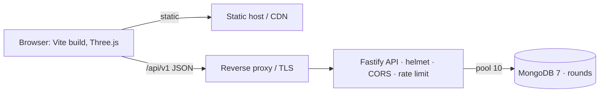
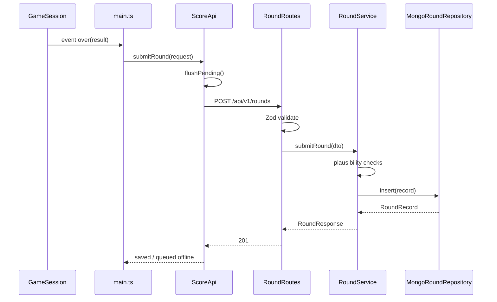

# Infrastructure & Deployment

## Runtime
- Node.js ≥ 20 (verified on 26.7), npm.
- MongoDB 7 (`docker compose up -d mongo`).
- Browser with WebGL2.

## Local run
```bash
npm install
docker compose up -d mongo
cp .env.example .env          # optional; defaults match
npm run dev:server            # API on :3000
npm run dev                   # game on :5173, /api proxied to :3000
```
Production: `npm run build` → static `dist/` (any static host/CDN) + `npm run start:server` behind a reverse proxy serving `/api`.

## Environment variables (validated by Zod at boot)

| Name | Default | Purpose |
|---|---|---|
| `PORT` | 3000 | API port |
| `MONGO_URI` | `mongodb://localhost:27017` | Connection string (put credentials here, never in code) |
| `MONGO_DB` | `tetracube` | Database name |
| `MONGO_MAX_POOL_SIZE` | 10 | Driver connection pool size |
| `CORS_ORIGIN` | `http://localhost:5173` | Comma-separated allow-list |
| `RATE_LIMIT_PER_MINUTE` | 30 | Round submissions per IP per minute |

Indexes are created on start (`ensureIndexes`). Graceful shutdown on SIGINT/SIGTERM closes Fastify then the Mongo pool.

## Topology


## End-to-end sequence

