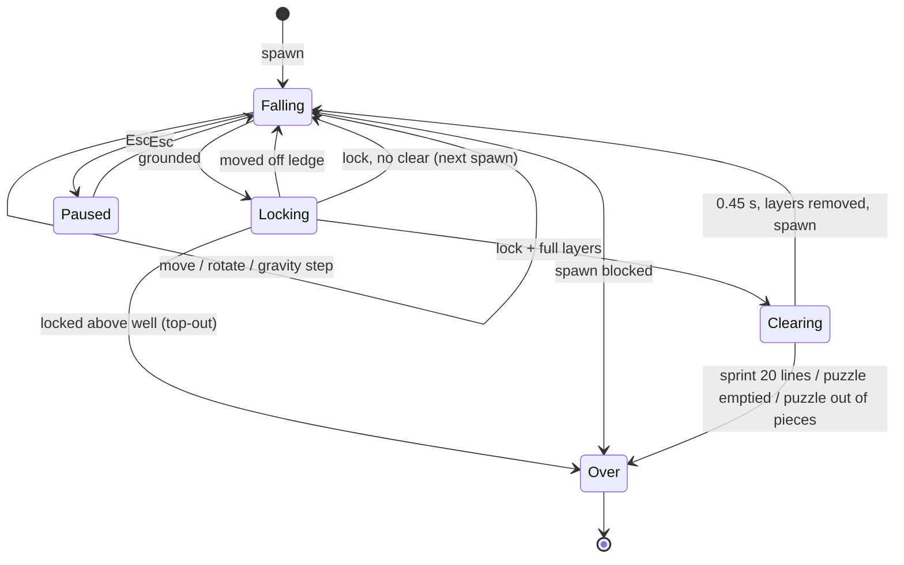

# Functional Specification

## Round flow
1. Menu: player name (2–16 letters/digits/space/_/-, validated by the shared Zod schema), mode, difficulty or puzzle.
2. Start creates a `GameSession` with a random 32-bit seed and picks a random Hong Kong backdrop.
3. Fixed 60 Hz steps: input repeat (DAS 0.17 s / ARR 0.05 s) → session → cosmetic motion. Render reads state.
4. Round ends → result panel → `POST /rounds`. Network/5xx failure queues the round in `localStorage` (max 50) and retries on next submit or page load; 4xx is shown and dropped.

## Session state machine

(`Locking` is the grounded sub-state of `falling` in code, tracked by `lockTimer`.)

## Rules
- Well: Easy 3×3, Normal 4×4, Hard 5×5, height 15. Puzzle wells use the puzzle's size; its ranking difficulty is derived from size (3→easy, 4→normal).
- Pieces: I, O, L, T, S always in each bag; Branch, Right Screw, Left Screw each join with 10/35/70 %. J and Z are omitted because they equal L and S under 3D rotation.
- Spawn centred at the top in the first orientation whose footprint fits (I spawns upright in 3×3).
- Rotation keys A/S/Z turn about the X/Y/Z axis around the piece pivot (Shift reverses), with kick search.
- Movement is camera-relative: arrows map to the grid axis matching the current camera quadrant.
- On-screen arrow pad (bottom-right) behaves exactly like the arrow keys, including hold-to-repeat (DAS/ARR); works with mouse and touch.
- Hold (C) once per piece; not in puzzles.
- Clears (marathon / sprint): every full row along X or Y clears; a completely full layer clears whole and pays a flat 2000 bonus. Each column then settles down by the cubes removed beneath it. Puzzles keep layer-only clears.
- Points per lock: (rowTable(rows) + 2000·layers + 50·combo) · level · colour, rowTable = 100/300/500/800 then +400 per extra row. Level rises every 10 lines.
- Same-colour bonus: a cleared row whose cubes are all one colour is a mono row. Same-colour mono rows chain when an X and a Y row cross on a layer, or when rows on neighbouring layers share a column. Best chain spans k axes (X, Y, Z = more than one layer) → colour = 2^k: ×2, ×4 (XY), ×8 (XYZ). Puzzle prefill never counts.
- Music: Korobeiniki (public-domain folk melody, the Tetris theme) synthesised with WebAudio, square lead + triangle bass, tempo +5 BPM per level, M key or HUD button toggles, choice saved in localStorage, stops on pause and game over.
- Modes: Marathon ends on top-out (`completed = true` always); Sprint completes at 20 lines, a full layer counting as 10 (ranked by time, only completed runs); Puzzle completes when the well is empty, fails when pieces run out.

## Boundary handling
- Cells above the well top are free, so rotation near spawn never fails on the ceiling; locking any cell above it is a top-out.
- Lock-delay resets capped at 15 to prevent infinite stalling.
- Frame delta clamped to 50 ms so a background tab cannot fast-forward.
- Audio context only after first key/pointer gesture.
- Server rejects: schema violations (400), implausible stats (422), > `RATE_LIMIT_PER_MINUTE` submits/IP (429), > 120 req/min global, body > 4 KB.
- Ranking/server unreachable: game remains fully playable; ranking panel shows an offline notice.

## Known limitation (security)
No authentication in v1: names are unverified and a determined user can post fake but plausible scores. The UI labels it "casual ranking". Upgrade path: submit the input log + seed and replay the pure domain layer on the server (it is deterministic for a seed).
