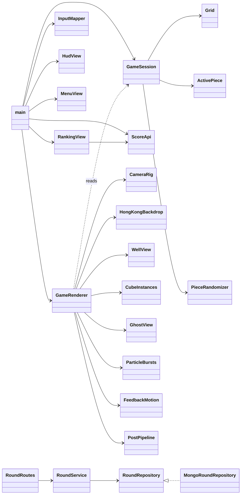

# Program Specification

## Directory map
```
src/shared/contracts.ts              Zod schemas + DTO types shared by client and server
src/game/
  config/tuning.ts                   TUNING constants, difficulty profiles
  domain/                            Pure rules, no Three.js / DOM
    vec3.ts rotation.ts tetracube.ts grid.ts active-piece.ts
    random.ts randomizer.ts scoring.ts puzzles.ts
  application/game-session.ts        State machine, fixedUpdate, commands, events
  presentation/                      Three.js adapter (reads session, never mutates it)
    game-renderer.ts camera-rig.ts coordinates.ts cube-instances.ts well-view.ts
    effects-views.ts feedback-motion.ts hong-kong-backdrop.ts post-pipeline.ts
    shaders/{common,cube,well,effects,hong-kong-backdrop}.glsl.ts
  infrastructure/                    Browser boundaries
    input-mapper.ts audio-synth.ts storage.ts score-api.ts
  ui/{dom,hud-view,menu-view,ranking-view}.ts
  main.ts index.html style.css       Composition root + loop
src/server/
  config/env.ts errors.ts domain/round.ts
  routes/round-routes.ts             Validation + status codes only
  services/{round-service,plausibility,cursor}.ts
  repositories/{round-repository,mongo-round-repository}.ts
  app.ts main.ts
tests/{domain,application,server}/
```

## Dependency graph


## REST API (`/api/v1`)

| Method | Path | Request | 2xx | Errors |
|---|---|---|---|---|
| POST | `/rounds` | `SubmitRoundRequest` `{playerName, mode, difficulty, score, layersCleared, piecesPlaced, durationMs, completed, seed, clientVersion}` | 201 `RoundResponse` | 400 VALIDATION_ERROR, 422 IMPLAUSIBLE_ROUND, 429 RATE_LIMITED |
| GET | `/rankings?mode&difficulty&period=all\|week\|day&limit≤100&cursor` | — | 200 `RankingPage {entries[{rank, playerName, score, layersCleared, durationMs, playedAt}], nextCursor}` | 400 |
| GET | `/players/:playerName/rounds?limit&cursor` | — | 200 `PlayerRoundsPage {rounds, personalBest, nextCursor}` | 400 |
| GET | `/health` | — | 200 `{status:"ok"}` | — |

All errors: `ApiErrorResponse {code, message, data, timestamp}`; every response carries `x-trace-id` (echoed from request header or generated).

## Data model — collection `rounds`
`{_id, playerName, playerNameLower, mode, difficulty, score, layersCleared, piecesPlaced, durationMs, completed, seed, clientVersion, playedAt, flagged}`

Indexes: `ranking_score {mode, difficulty, flagged, score:-1, _id:-1}`, `ranking_time {mode, difficulty, flagged, completed, durationMs, _id}`, `player_history {playerNameLower, _id:-1}`. Pagination is keyset (base64url `{value, id, rank}`), never `skip`.
